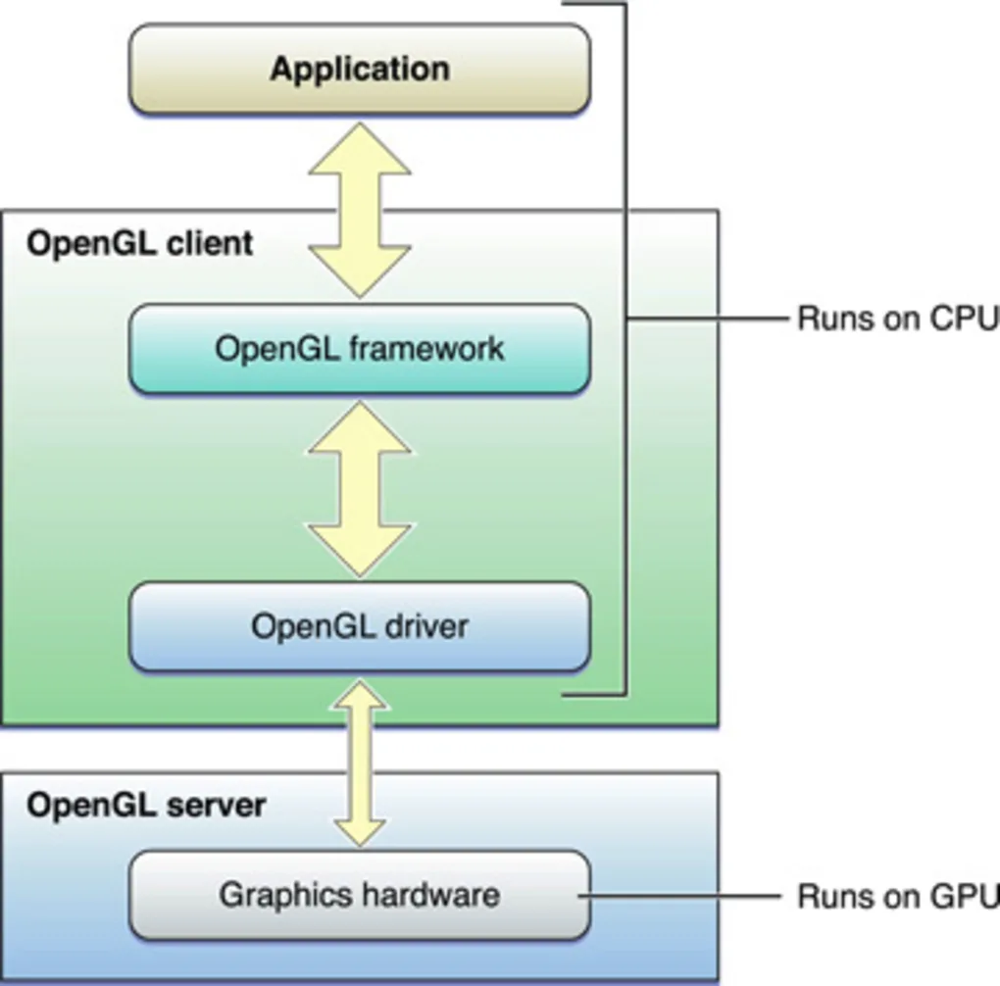
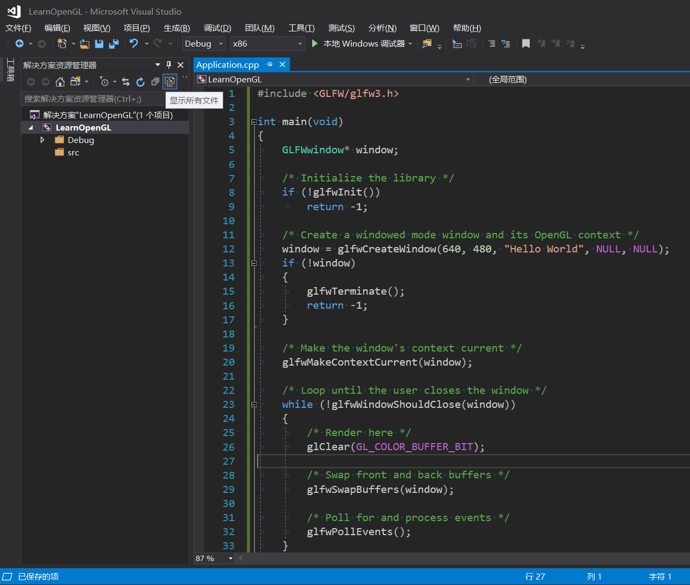
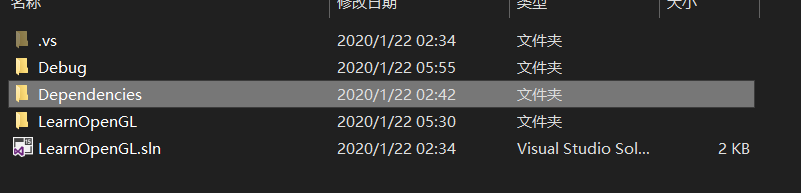
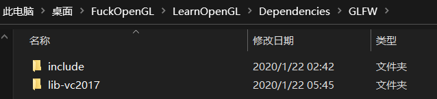
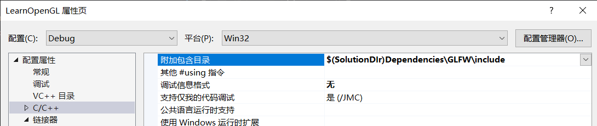
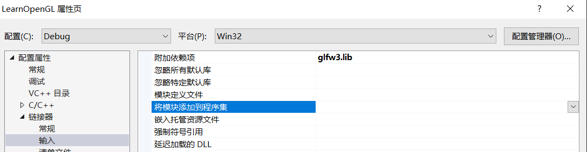
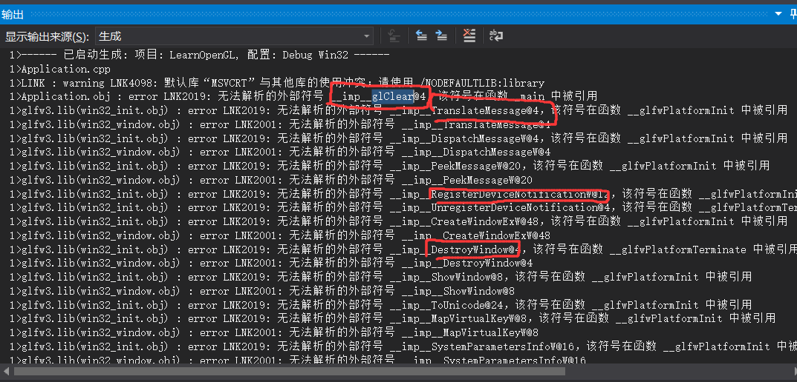
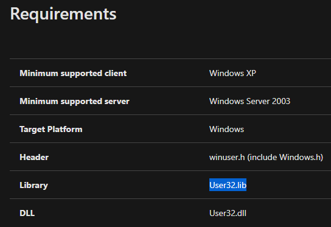
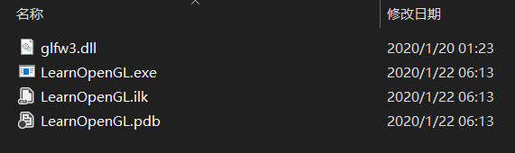

- [OpenWindow](#openwindow)
- [DrawTriangle](#drawtriangle)


## OpenWindow
OpenGL是一个跨平台的图形API, 通过它可以让GPU去显示图像, 
所以第一件事, 就是让操作系统开一个窗口, 从而让我在这个窗口上去画一些我们想要的图像, 然而虽然OpenGL是跨平台, 但是其本身只是作为一个协议而已, 在不同平台上都有各自的实现版本, 因此即使是"打开一个窗口" 这样的操作, 在不同平台上都会有相应的实现, 比如说在windows上, 显然是通过winAPI去完成开窗的步骤.  简单起见, 我们利用第三方库「GLFW」去实现开窗的操作. https://www.glfw.org/
首先, 我们先进入<a href ="https://www.glfw.org/documentation.html">doucuent</a> 其中的"Example code" 就是通过「GLFW」来开窗的流程(非常的简洁). 接着, 我们在vs(我使用的是vs2017) 去创建一个"empty project", 接着我们就可以将这段代码复制过来. 

> 值得一提的是, vs的解决方案的路径是逻辑上的, 它分了"头文件" "源文件"... 但是当你实际去创建file的时候, 在实际的资源文件夹中, 它是直接散落一地, 并没有真的创建了这个文件夹, 所以, 我们可以点击"显示所有文件" 从而显示出真正的文件结构, 然后创建一个"src" 文件夹来放置我们的code.

当然, 这个时候并没办法run, 毕竟我们还没配置好环境, GLFW我们都没下, 进入到GLFW的下载界面 https://www.glfw.org/download.html, 我们去选择"32bit binaries" 下载.
> 32/64 指的并不是电脑操作系统是多少位数, 而是指你的project platform是多少位数, 通过看工程属性就会显示平台的类型. 其次binaries文件是已经编译好的文件, 不需要再编译. 当然, 有时候也可以直接下载源代码去编译生程lib/dll.


在压缩包里, 我们可以看到有dll和lib, 也就是动态库和静态库, 静态库和普通源代码并没太区别, 同样都是在编译之前就加载好了; 而动态库则是在运行时调用; 压缩包里 有一个 "glfw3dll.lib" 的文件, 容易让人误以为是静态库, 实际上它是"动态链接库的导入库", 这是由于Windows下的链接器只能处理.lib这样的非可执行文件，不能处理.dll这样的可执行文件，所以用一个导入库（.lib）来辅助链接.  具体了解可以参考  https://blog.shengbin.me/posts/windows-dll-with-lib


- -----使用静态链接-----
首先, 我们可以现在创建一个文件夹用来放第三方库, , 讲压缩包里的"include" 和 "lib-vc2017" 复制过去即可;
, 由于我们使用的是静态链接, 在"lib-vc2017"中, 我们只需要"glfw3.lib" 就够了, 另外两个用于动态链接的文件, 完全可以删除掉;

这个时候 我们去把这个库添加到project中, ($(SolutionDir)代表的是.sln的位置), 之后点击"链接器" 把 "附加依赖项" 里面的都删掉, 写上我们需要的"glfw3.lib" 即可.
这个时候进行编译, 在输出里面会出现很多的"link erro", 这是因为我们删掉了太多的"附加依赖项", 所以接下来, 我们来根据这些信息, 来添加我们所必要的lib, 

首先第一个, "glclear", 这个是我们的代码里面的一个function, 不难注意到, 其它都是glfwxxx, 只有它是glxxx, 没错, 因为它是opengl的函数, 而我们只添加了glfw的lib,  所以我们要添加opengl32.lib, 添加完后, 再运行, "glcear" 的错误就没有, 后面的一些error 则是windows的一些lib, 我们Google搜索它, 找到对应的lib添加就可以了, 举个例子"RegisterDeviceNotificationW", 
 把这些lib都附加上去, 这些link 就解决了.

基本上
```
glclear()                     --> opengl32.lib
RegisterDeviceNotificationW() --> User32.lib
CreateDCW()                   --> Gdi32.lib
DragQueryFileW()              --> Shell32.lib
```
- 使用动态链接
使用动态链接库, 我们需要留下的就是"glfw3dll.lib"和 "glfw3.dll", "glfw3dll.lib"放在老位置, 而dll则需要放在 .exe文件中, 当然! 别忘了修改下 依赖项的名字! 现在不叫"glfw3.lib"了!


## DrawTriangle
最后在这个窗口里利用OpenGL提供的API来画个三角形吧!
```c++
while (!glfwWindowShouldClose(window))
	{
		/* Render here */
		glClear(GL_COLOR_BUFFER_BIT);
		glBegin(GL_TRIANGLES);

        //  Draw Triangle
		glVertex2d(-0.5f, -0.5f);
		glVertex2d( 0.0f, 0.5f);
		glVertex2d( 0.5f, -0.5f);
		glEnd();

		/* Swap front and back buffers */
		glfwSwapBuffers(window);
		/* Poll for and process events */
		glfwPollEvents();
	}
```

